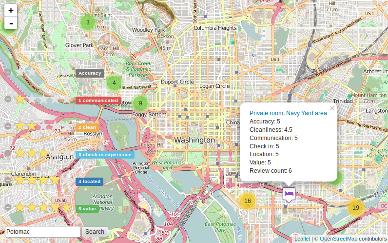

# AirBnB Listings by Reputation and Description

by [Talha Oz](http://twitter.com/tozCSS)

## Abstract
Reviewing is a feedback mechanism that e-commerce sites leverage to help their customers make more informative purchase decisions on their platforms. Although the biggest online sellers such as Amazon and eBay allow their users to filter the search results by seller reputations, the leading space sharing platform AirBnB lacks this crucial feature. Even more disappointingly, AirBnB does not allow it’s users to search for keywords within listing contents (descriptions). In this project, I create a demo geo-web application to meet these needs of AirBnB users. The application allows its users i) to filter the listings by review scores for six reputation categories, ii) to search in listing descriptions, and iii) to experience better visualization by adopting a different marker for each listing room type and by providing clustered-listings view. I demonstrate the application for the Washington, D.C. area by utilizing a publicly available AirBnB listings dataset.

Software & Libraries
--
- Postgresql (with PostGIS)
- Geoserver
- Leaflet.js
- Python Pandas

Screenshot
--
